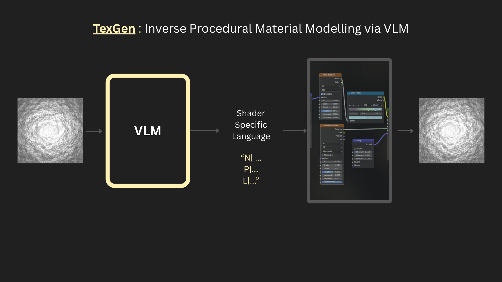
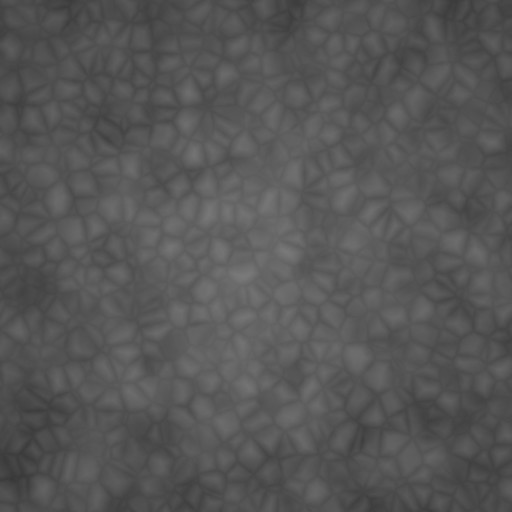
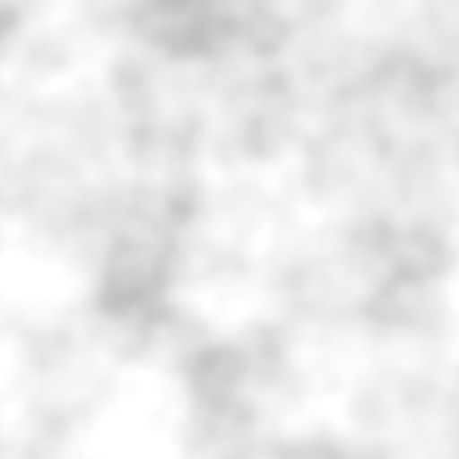
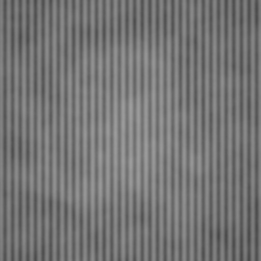
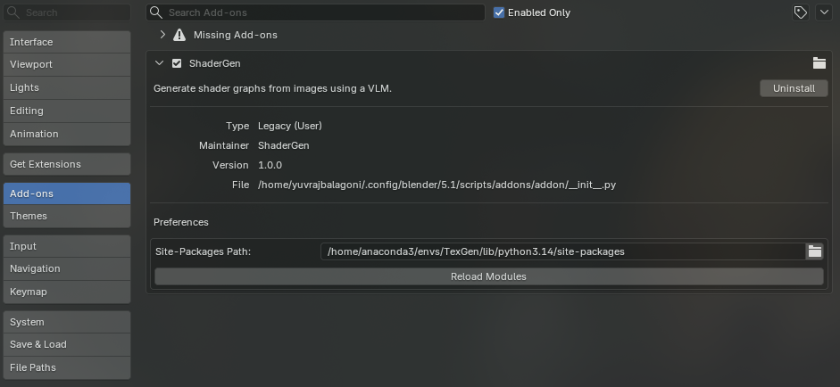
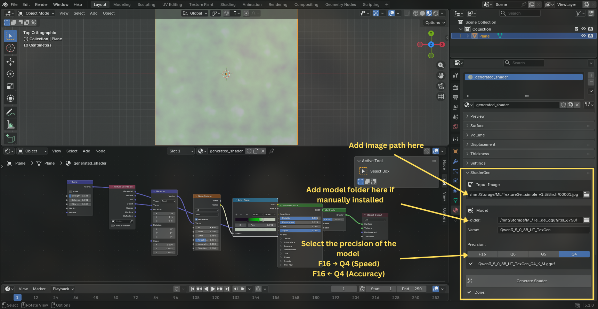
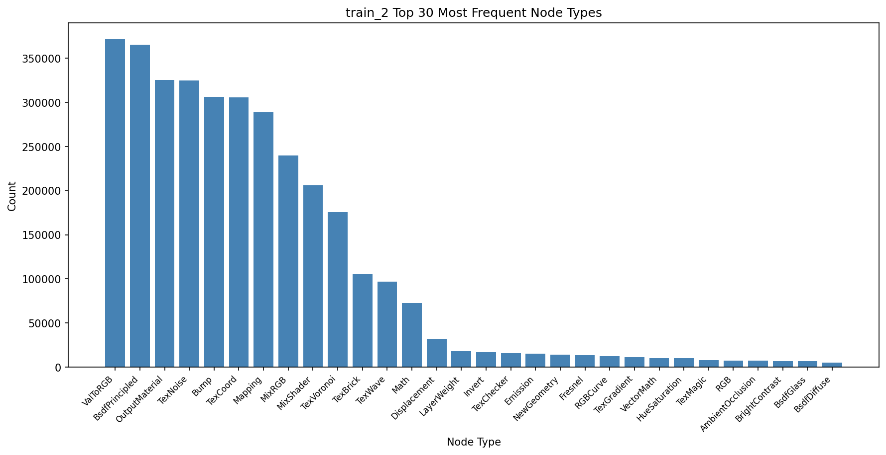

# TexGen : Inverse Procedural Material Modelling via VLM.

TexGen is a inverse procedural material model that takes a texture image as input & generates a Blender procedural material graphs for that specific image for highly customizable, editable material workflows.

<br>
UPDATE: Still working on this project so some information code might have mismatch here & there.

# Overview 
Existing work on material generation focus on synthesizing image based texture maps which are baked & static. TexGen tries to generate the procedural shader graph for the given image which are editable, giving more control in the overall workflow.

```
Input Image -> fine-tuned VLM -> DSL based shader -> addon creates the shader graph
```

# Results / Examples

|input image | Output render |
|---|---|
|||
|||
|||
|||
|||

# Usage 
### Installing Addon
install the TexAddon.zip file from the repo & install it in blender by going -
```
Edit -> Preference -> install from disk -> TexAddon.zip
```
now the addon will be visible in the properties -> material -> TexGen
before using the addon it requires an python environment for it.

Create conda environment for the addon -
```bash
conda env create -f addon_environment.yml                   # download from addon folder
conda activate TexGenAddon
python -c "import site; print(site.getsitepackages()[0])"   # this tells where the env packages are add this to env_dir in the addon panel
```
Now add this env path to the Addons preference panel site packages path -


### Using Addon
So the addon will be present in the properties -> material panel


add model path if installed the model manually from huggingface or else the addon will install it for you & save it in huggingface cache.

# Key Highlight of project -
- **Inverse Procedural Modelling** : Given an image the model will generate a shader graph corresponding to that image.
- **Dataset** : Converted VLMaterial dataset (target was a python script for the material) into a Domain specific language for shader graph. Why & How in this doc [DATA.md](docs/DATA.md).
- **Model** : did lora fine-tuning for Qwen3.5-0.8B model More info here [TRAIN.md](docs/TRAIN.md).
- **Experimentation - Custom tokens** : added new additional domain specific tokens to the models tokenizer vocabulary for efficient shader representation. In details at [DATA.md](docs/DATA.md).Also trained the additional embeddings for the new added tokens. Also untied the weights for the new embeddings & lm head as untying helped model performed & learned better than keeping them same. But it still took longer time to train & achieve similar result to that of just LoRA training so scrapped it.
- **Quantization** : Quantized the model into multiple precision (Q8_0, Q5_K_M, Q4_K_M) using llama.cpp in gguf format. Available at huggingface - [huggingface_link](https://huggingface.co/YuvrajB13/Qwen-3.5-0.8B-TexGen-GGUF/tree/main).
- **Blender Addon** : Created a blender addon to use the model.

# Metrics

During training, we do evaluation after every 2500 iterations because running an entire epoch takes a long time & we need to know how our model is performing. Although having smaller training & eval loss tells us the model is learning but it doesn't tell us about the quality of our output.
Therefore we have 2 metrics (between rendered image from generated output & input image) -
1. CLIP Similarity Score - For global context
2. LPIPS Score - For finer details.

|Model|model CE loss|CLIP|LPIPS|no of errors|
|---|---|---|---|---|
|`LoRA Only`|0.45|0.80|0.49|16|
|`New tokens + LoRA`|0.57|0.82|0.48|0|

As expected, the LoRA-only model learned faster compared to the model with new tokens. It reached a loss of 0.45 after processing roughly 2k samples, then saturated and continued learning slowly afterward. The new-tokens model, on the other hand, plateaued around a CE loss of 0.57 at roughly 12k samples and has remained saturated near that level since, taking longer time & resources to adapt.
As we look at samples themselves then LoRA only model performs better where as for shader language generation LoRA + additional tokens model performed better with minimal issues / errors bacause it is good with the language terminologies but takes way longer to train. for more comparison refer this ['comparison'](docs/COMPARISON.md) (UPDATE - Not yet added).

# Project Structure
```
TexGeneration/
├── src/
│   ├── model/
│   │   ├── train.py                # training script
│   │   ├── dataset.py              # ShaderDataset
│   │   ├── inference.py            # inference pipeline using transformers
│   │   ├── infer.py   
|   |   ├── embeddings.py           # Custom new embeddings implementation
|   |   ├── merge_lora.py          
|   |   ├── renderer.py             # Render generated samples during eval         
|   |   ├── metric.py               # Calculate metrics
|   |   └── utils.py                # logging, saving & loading ckpts
│   └── data/
|       ├── additional_tokens.py    # Getting tokens not present in tokenizer
|       ├── convert_dataset.py      # converts python data into dsl
|       ├── dsl.py                  # shader code for conversion
│       └── txt_shader.py           # main shader code to create material
├── docs/                           # Yet to come ....
├── addon/                          # Addon folder with essential scripts
│   ├── __init__.py       
│   ├── gguf_inference.py
|   ├── txt_shader.py
|   └── addon_environment.yml
├── TexGen_Addon_.zip                # Zip file of addon
├── environment.yml               
└── README.md
```
## Scripts Usage
1. ### Installing dependencies
```bash
git clone https://github.com/YuvrajBalagoni13/TexGeneration.git
cd TexGeneration
conda env create -f environment.yml
conda activate TexGen
```
2. ### Training scripts
    So for training we have a config file at [config/train.yaml](config/train.yaml).
    training params -
    | Parameter | Value |
    |---|---|
    | `model_base` | Qwen3.5-0.8B |
    | `batch_size` | 4 |
    | `gradient_accumulation` | 4 |
    | `lora_r` | 32 |
    | `lora_alpha` | 64 |
    | `lora_dropout` | 0.0 |
    | `precision` | float16 |
    | `lr` | 5e-5 |
    | `lr_embeds` | 5e-6 |
    | `lr_scheduler` | cosine |
    | `warmup_steps` | 25 |
    | `add_new_tokens` | True |
    | `mean_subwords` | True |

    Also refer [TRAIN.md](docs/TRAIN.md) for more details regarding them.

    **training script** - [train script](src/model/train.py)
    ```bash
    python -m src.model.train \
    --run_name name_of_run_to_log_in_wandb \
    --config config/train.yaml \  
    --load_ckpt_dir path_to_saved_ckpt_directory \
    --load_state_dir path_to_saved_training_state_directory
    ```
    This script will save model checkpoints for LoRA weights, new additional embeddings & new lm head weights in wandb with the training states (optimizer state, scheduler state) to continue training when interrupted.
    As we have a lot of samples for training & google colab's T4 as our GPU & savior (T_T). So doing eval after an epoch will take a lot of time so this does evaluation every 2500 iterations in the dataset. 

3. ### Evaluation Scripts
    So evaluation during training tells us if the model is performing good based on it's output shader graph but what we want is to see if the model's generated shader graph generated texture similar to the input image or not.
    For this we have few scripts to do evaluation based on the quality of the generated texture.
    1. **Inference script** - [infer script](src/model/infer.py)
    ```bash
    python -m src.model.infer \
    base_model Qwen/Qwen3.5-0.8B \
    --lora_path path_to_saved_ckpt \
    --eval_data_path path_to_eval_dataset \
    --save_json_path path_to_save_outputs \
    --data_length 1000 \                        # no of samples to do inference on.
    --batch_process \                           # If to do batch process
    --batch_size 128 \
    --new_tokens                                # If added new tokens
    ```
    This was the main inference script to generated outputs for evaluation.
    this will give a json path with json as - `{image_path : output}`.

    2. **Rendering Script** - [renderer script](src/model/renderer.py)
    ```bash 
    blender \               # path where blender's executable is located
    --background \          # to run blender in background
    --python src/model/renderer.py \
    -- \
    --output_json_path output_json_from_inference \
    --save_json_path path_to_save_resulted_json \
    --render_path path_to_save_rendered_images
    ```
    This script will give another json which consists of image_path, shader_text_path, output shader from model, render path for target & output, errors if any occured.

    3. **Metric** - [metric script](src/model/metrics.py)
    ```bash
    python -m src.model.metrics \
    --result_json_path result_json_from_renderer
    ```
    This will add the metric scores for every samples.

Alterenatively if want to run all together than -
```bash
bash scripts/run_eval.sh \
  --model_base "Qwen/Qwen3.5-0.8B" \
  --lora_path path_to_saved_ckpt \
  --eval_data_path path_to_eval_dataset \
  --output_json_path path_to_save_outputs \
  --result_json_path path_to_save_resulted_json" \
  --render_path path_to_save_rendered_images \
  --data_length 100 \
  --batch_process \
  --batch_size 4 \
  --new_tokens  
```

Also for normal inference of samples, best way is to use the addon itself [see addon section](#usage).

# Current Limitations
1. Imbalance with nodes in dataset.

as we can see top 10 nodes occur 80+% of overall shaders.
Now this issue comes from the original dataset itself. With better model & full fine-tuning the model will be able to adapt to this but with our constraint with resources, our model needs better quality dataset for more expressibility in the results.

# Future Work & Ideas
1. Generate a better quality dataset.
2. Further train the model with Reinforcement Learning to align the output better with the input with similarity metrics as reward functions. Also our shader script gives specific errors where the model failed so we can use these errors to further structure the rewards to be token specific feedback.
3. Train the model on textual descriptions of the textures so that we can generate shader graphs with just text prompts too.