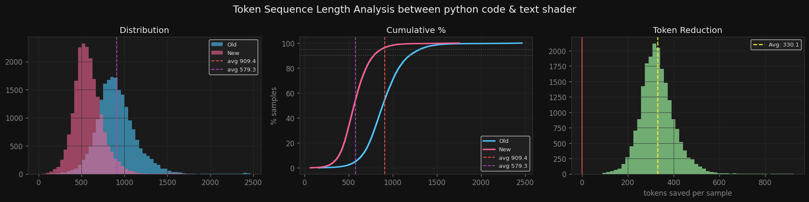
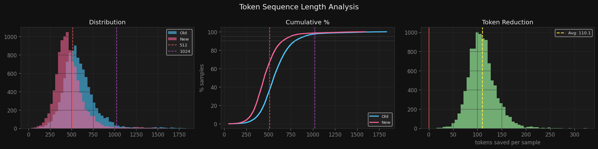

# VLMaterial Dataset issues -
So the original dataset had about 500k+ samples & was made using blender 3.6 version.
It was using Python script as the target for shader materials.
The main issue with the dataset were -
- It had unwanted token usage for a lot of repeated words - avg 909.4 tokens per sample
	- example - ShaderNode{node_name} every node has ShaderNode as it's prefix which just eat up the tokens while generation.
	- .default_value, nodes.new, links.new, also first three lines were sample for every samples.
	- this scales really badly with increased complexity of the shader graph.
- The way they assigned properties - so the python code assigned the properties & links with the help of indices to inputs.
	- What is the issue here? - well first the model never knows what is the representation of that specific indices, because it would be better to know what is the description of the specific property like scale, smoothness, color, etc, which adds more meaning in understanding the property.
	- Another issue with this is the version changing - if we trained the model on the python scripts generation,  it becomes stuck at that specific blender version only (3.6) because in each updates indices can change a lot (if any new property is added or discarded or it just get's reshuffled). So we would have to curate dataset for all node's & their changed properties & retrain the model again to reassign the learned knowledge of specific index to another value, which will need a lot of training & is highly inefficient.

### Example shader -
```
import bpy

def shader_material(material: bpy.types.Material):
material.use_nodes = True
nodes = material.node_tree.nodes
links = material.node_tree.links

# Create nodes
material_output = nodes.new('ShaderNodeOutputMaterial')
mix_shader = nodes.new('ShaderNodeMixShader')
mix_shader_002 = nodes.new('ShaderNodeMixShader')
layer_weight_002 = nodes.new('ShaderNodeLayerWeight')
... so on

# Create links to connect nodes
links.new(mix_shader.outputs[0], material_output.inputs[0])
links.new(mix_shader_002.outputs[0], mix_shader.inputs[1])
links.new(principled_bsdf.outputs[0], mix_shader.inputs[2])
... so on

# Set parameters for each node
rgb_curves.inputs[0].default_value = 0.948
rgb_curves.inputs[1].default_value = [0.223, 0.172, 0.167, 0.694]
rgb_curves.mapping.curves[3].points[0].location = [0.021, 0.031]
rgb_curves.mapping.curves[3].points[1].location = [0.428, 0.314]
rgb_curves.mapping.curves[3].points.new(0.923, 1.12)
power.inputs[1].default_value = 2.34
... so on
```
# My Solution to this ?
Well initially i was planing to structure this in json with actual property names & so on but it had the same issue of repeated values which uses a lot of tokens.
So at the end I created Domain Specific structured language (DSL) for this specific task -

### Structure of it -
#### Example -
```
N|material_output:OutputMaterial;mix_shader:MixShader;principled_bsdf:BsdfPrincipled;bump:Bump;noise_texture:TexNoise;mapping:Mapping;texture_coordinate:TexCoord;brick_texture:TexBrick;wave_texture:TexWave
P|principled_bsdf.i-Roughness.dv:0.342;principled_bsdf.i-Anisotropic Rotation.dv:0.005;principled_bsdf.subsurface_method:'BURLEY';bump.i-Strength.dv:0.241;noise_texture.i-W.dv:0.026;noise_texture.i-Scale.dv:0.765;noise_texture.i-Detail.dv:9.92;mapping.i-Scale.dv:[1.19, 4.63, 0.849];brick_texture.i-Mortar.dv:[0.452, 0.392, 0.199, 0.733];brick_texture.i-Mortar Size.dv:0.012;brick_texture.i-Mortar Smooth.dv:0.068;wave_texture.i-Scale.dv:9.41;wave_texture.i-Distortion.dv:38.5;wave_texture.i-Detail.dv:12.0
L|mix_shader.Shader>material_output.Surface;principled_bsdf.BSDF>mix_shader.Shader;brick_texture.Fac>mix_shader.Shader_001;bump.Normal>principled_bsdf.Normal;noise_texture.Fac>bump.Height;mapping.Vector>noise_texture.Vector;texture_coordinate.Object>mapping.Vector;wave_texture.Color>brick_texture.Color1
```
So first line is for Nodes starts with N|<br>
second line for properties - P|<br>
last line for links - L|
#### Nodes-
At nodes line we assign a node to a variable like -<br> **material_output:OutputMaterial**<br>
where OutputMaterial is the blenders naming convention & material_output is just a variable which has contents of the OutputMaterial node. (blender has it as ShaderNodeOutputMaterial)

#### Properties-
At properties line we assign properties based on their path to the property like this -<br>
**principled_bsdf.subsurface_method:'BURLEY';**<br>
here ,
- **principled_bsdf** : node variable name<br>
- **subsurface_method** : property name<br>
- **'BURLEY'** : Assigned value<br>
if the property name as a prefix then -<br>
- **i-** : means it is an input property<br>
- **e-**: means it is an element (example - used on colorramp for multiple instances of colors & their positions)<br>
- **c-**: means it is a curve element (example - used in rgb_curve)<br>
- **p-**: means point (used with curves as they have points in it which modifies the curve)

#### Links-
At links line, we link nodes based on their output sockets & input sockets so -<br>
**mix_shader.Shader>material_output.Surface**<br>
means ,
- **mix_shader** : node variable name<br>
- **.shader** : is the output socket of the mix_shader<br>
- **\>** : means to link to<br>
- **material_output** : node variable name<br>
- **.Surface** : is the input socket of material_output<br>

So this is the basic structure of my attempt at creating a better representation of shader graph generation.<br>
Can refer to script - src/data/txt_shader.py for the code of this where I convert this DSL into actual material in blender. (Yet to implement the inverse)<br>

Now my implementation of shader graph representation (DSL) uses less token consumption as compared to the original python based representation by 36.3%.



I further reduced this by adding custom new domain specific tokens like (PrincipledBSDF, ColorRamp, etc) which further reduced token consumption by 12%.



So in total my custom shader implementation & custom tokens almost halfed the token consumption per sample. (~48%).
we'll talk about the custom tokens again later.

### How does this solve the issues by the previous attempt:
- Reduced the token usage by almost half (~48%)
- Uses property names itself to assign values instead of indices so even if the properties gets reshuffled in the future or any new properties are introduced we won't need to retrain the model on all the properties, just on the added, removed or renamed properties only. If only reshuffle happens then no training required, & if any node or property is depreciated then we can do reinforcement learning to make the model avoid those properties & nodes only & would have no need to train the model on all the properties again.
The script [src/data/txt_shader.py](../src/data/txt_shader.py) gives specific errors mentioning where exactly the text is invalid which can be really helpful for understanding where the issue is present in the generated text & what needs to be done further.

# How did I converted the python scripts into DSL?

using AST (Abstract Syntax Tree)<br>
This converts the python script into a tree, & we can loop through all it's nodes with ast.walk(tree) with tree beign ast.parse(python_script).<br>
now everytime we assign some value to a variable (=) it is stored as an ast.Assign instance.<br>
nodes.new() this is an ast.Call instance<br>
properties are stored as ast.Attribute instance.<br>
values are stored in ast.Constant instance.<br>
indexes are stored as ast.Subscript instance.<br>
So basically used this to extract all the values, variable names, node names, links, etc.<br>
Can go over the script - [src/data/dsl.py](../src/data/dsl.py) ConvertCodeToDSL class.

also in previous dataset (python script one) properties were assigned with indices but I wanted it to have their respective property names.<br>
So to do that I had to do few things - <br>
1. first I extracted all the information about nodes & their properties & stored them in a json file for version 3.6 (on which the dataset was created) & also for version 5.1 (latest version as of the development of the project).
2. then I mapped all the indices to blender 3.6 versions property names & see if they existed in the version 5.1 (latest). did same for nodes & link sockets.<br>

filtered dataset based on these constraints & got a dataset of 300k+ samples.
